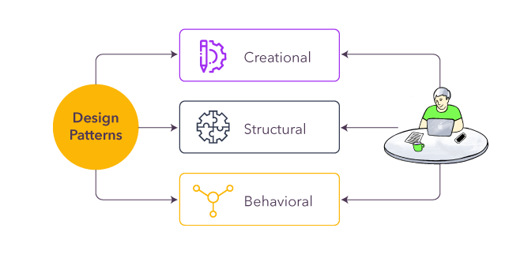

### Have I really been using software design patterns?
  While first reading the topic of this essay, I was originally very confused as to what design patterns even meant. Maybe it refers to how I would organize and code things, similar to coding standards? Or maybe even just different abstraction levels/scalability of software? Well, after a quick google search it seems that it includes those and other similar features and ideas when making software,
  organizing and defining them into different categories. However, at its core, most of the patterns are essentially well defined approaches to different problems in software design. It seems that all of these defined software patterns could be both formally, intentionally applied or applied unknowingly, as I believe a majority of us in ICS 314 would fall into the latter category.

### What do design patterns even consist of?
 

  After searching a little bit, it seems that there are numerous design patterns, compiled and analyzed throughout many years, usually referring to different aspects of design patterns. While some of them aren't very applicable to us students currently, as we haven't touched upon certain issues solved by such design patterns or simply have not needed to solve a problem like that, we actually have run into
  many design patterns, as for example in this class I believe that we have mostly dealt with creational and behavioral patterns, such as unknowingly using factory patterns through changing output based on paramters/input, which could also be extended to leaving object/action details up to subclasses. Another common one we have also most likely used includes things in the behavioral patterns category, such as observer patterns, a seemingly
  commonly used pattern, as even in things like button event listeners, we are essentially having objects or other components change based on anothers status or action, a generalization that could be applied to a whole lot of parts of software development, and especially with anything interactive. Another very important pattern would be the memento method pattern, which seems to basically refer to saving an object state, returning to it later
  as needed or using it in some other way, like possibly even some kind of analysis based on past states. This seems to be a similar concept to just "saving", keeping track of the state of things that have occurred. I could see things like github commit histories or even something like document saving being very similar implementations of something like this.

### Design patterns, software specific or not?
  Conceptually, design patterns seem to be not that different from tried, reusable solutions to common problems we might encounter in everyday life. Most of us definitely have a pattern of doing something, efficient or not. A pretty relatable one would be even something like a cooking recipe, as some ratio of ingredients is more optimal than others for a given recipe (depending on how you want it) or even cooking techniques themselves, such
  as something like sauteeing, baking, and other cooking techniques essentially being adapted to certain recipes, essentially a reusable "solution" (or in this case, method of cooking) to get a desired outcome. Heck, this could even include something like the teaching approach/strategy for this class (the athletic software development and WODs), giving a form of generalized, reusable structure (the pattern) to the teaching, while also addressing
  different concerns such as how the class could be taught in both an innovative and efficient way, benefitting both student and instructor. I think that we apply design patterns in many areas of our life unknowingly, and I believe that recognizing and efficiently using them could prove to be a great asset to not only software development, but pretty much any problems we're faced with.
  
