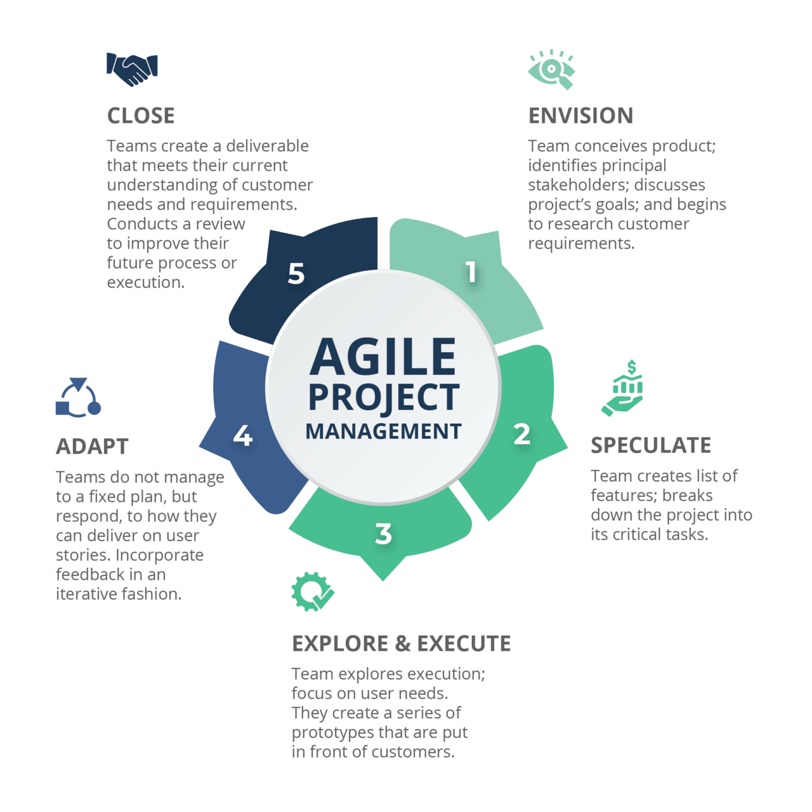

## Then and now
  Now that this semester is coming to a close, I feel that much has changed, both in my perspective of software engineering and how I approach many different problems, as I believe that through taking this course, my fundamental understandings of project planning and
  organization has seen a sizeable improvement. Specifically, the concept of Agile Project Development in conjunction with Issue Driven Project Management was a rude awakening for me, as conceptually I have never really had to both work in a team on a software engineering
  or even computer science related topic ever, and much less something on this (comparatively to what I've done before) "larger-scale" project, requiring structure and consistent planning for efficient project progress. In addition to this, it would also be interesting to touch
  more on the topic of User Interface Frameworks and possibly other frameworks in general, as I found those (along with many other subjects we've discussed) to be very relevant and something that was pretty new to me.

## Breaking up the problem: Agile Project Management
  For something like our (now complete) final project, finding a way to manage each person in the group effectively, ie. everyone can contribute without dependencies on someone elses work, avoiding some kind of gridlock, it was essential to figure out how we wanted to portion out
  the project into bite sized chunks. While there are so, so many methods and models to split a project, specifically software related, into a relatively efficient workflow, for this class it seemed that the agile project development model, specifically through issue driven project
  management, seemed to be both the most beneficial to us as students and for something not extremely large scale in production. Quickly getting feedback from our teammates from testing, all while splitting the project into bite sized "issues" made the development process relatively smooth.

### Milestones and issues, the cornerstone of progress
  Our project was primarily split into the requirements, which was essentially our end stage, final product, which we then carefully portioned into the three milestones, each being large, progressive steps based off the functionality and appropriateness of the latter milestone, incorporating
  more features as we make progress. However, this style also felt a little bit too "rigid" at times, with us experiencing something akin to "scope creep", albeit on a smaller scale, wanting to occasionally add in interesting functions and attributes to the project that we originally did not
  envision even being a part of it at the time. Thankfully, it all came together nicely, adding in just enough new innovation throughout the development process while also not losing sight of the original functionality and project level we had in mind from the start, with some cool new features
  in addition. Much of these milestones were portioned into issues added to our issue board, where we would essentially take the milestone requirements, split those into even smaller chunks, and then have each of us choose a couple we would like to work on. While sometimes the issues did indeed clash,
  where two people would take tasks that might deal with the same file or page, we managed to communicate effectively enough that there never really was major delays, albeit maybe it wasn't the most efficient split, looking back at it now. In addition, our branch and issue related name conventions did
  indeed stray a bit from what the professors required from us, naming issues based on branches and their number, I do understand how that naming convention might be more relevant and helpful for us in terms of organization.

### Beyond the scope of software
  Of course, the whole idea of project management could just as easily be applied to something completely unrelated to software engineering; pretty much any project could benefit from an approach like this! I've actually thought about how many of the more organizational and planning approached we've learned
  in class might actually applicable in my life in different areas. As long as the problem can be split (which I'd find it hard to believe there isnt one), it could always be managed and split amongst people in an effective manner, not even formally applying any specific project management format. Recently, we
  actually had a christmas party at our church and while I did not really help with planning it, my parents were mostly helping to efficiently split the party setup into manageable, streamlined, and parallel tasks, where everyone was assigned a role in a way that every task was done in conjunction, and I gotta say
  the setup went pretty damn fast. Table and chair setup, decorations, food preparation, sound system and projector, everything went quite smoothly, all due to proper person management and coordination, which I think is an excellent example of "project" management.

## Unfamiliarity of frameworks
  When using something like React-Bootstrap, which was our component and css centered framework used for the final project, it definitely made me wonder about all the possible libraries and relevant frameworks out there. For the purpose of user interface and web page designing, I believe that as my first experience
  with both user interfaces and frameworks, it was quite nice to work with, giving some freedom and cohesion when designing a majority of the pages. I would definitely like to check out some more User interface frameworks and see how their capabilities (and maybe project relevance?) line up with React-Bootstrap, as
  each one is likely suited for different projects, requirements, and even overall comfort. I believe it would be of great benefit to do some searching and testing on my own time with regards to this, along with many other topics we've covered, especially the development environments, programming languages, and database
  interaction, as I believe there is some room for me to grow, having seen how complex and deep those topics can be taken. Regardless, I believe that this class has taught me not only what to expect later in my journey, but also just how deep the rabbit hole goes for these, inspiring me to strive to learn, become more adept
  and proficient with these skills, all while trying to have some fun with it and see the bigger picture, whether that be where I'm heading or how this can be applied to other areas of my life!
