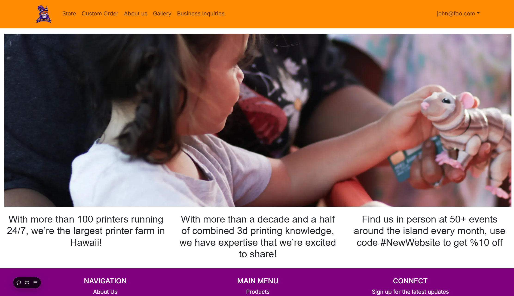

# Project summary and development
  This project is pretty much a demonstration of skill application and accumulation throughout both me and my classmates journey through our ICS 314 class, software engineering. We learned much about how code is standardized, good work practices,
  team management skills, and adaptability and self-learning. As such, we were tasked to create our own website, which could have any purpose we wished, as long as it complied with the professor's standards and most importantly, what we were 
  passionate about. While we shuffled through many ideas originally, one of our members, David Gieselman, just so happened to work at a 3D printing company, 3D Wizards Inc, and they were highly in need of a website to help streamline and automate
  orders. As many of us saw the potential impact this project could possibly have on not only our class grade, but also in terms of real world impact, me personally, I was ready to completely commit to this idea. It was pretty fun to have the chance
  to make something that would actually see the light of day, having a chance to make a difference in peoples lives. So there you go, the origin story of this project!

# Project details
  The website was primarily developed using a nextjs template referred to us by our professors, which we then subsequently developed and built upon, adding our own unique functionality and flair to the site and quickly repurposing it for order submission.
  While I wouldn't say its at an industry standard in terms of aesthetics or complete functionality, I believe we had accomplished a sizeable amount of work. However, there is definitely room for improvement in many aspects, either polishing currently added features
  or adding QOL features to the site. In terms of development specifics, the application as a whole was developed as a NextJS app, primarily using VSCode as our IDE with both the front-end and back-end utilizing Typescript. For our database, we made use of a postgres
  database. For project deployment, we used Vercel, which hosted the site and also our postgres database. In all, this project was actually really fun to work on, both on the project itself and collaborating with my teammates. For more information, the project information
  will be put down below:

  Project deployment: [3D Wizards Inc. Vercel App](https://3-d-wizards-inc-two.vercel.app/)
  Source code/github: [3D Wizards Inc. Github](https://github.com/3D-Wizards-Inc/3D-Wizards-Inc)
  Project description and development documentation: [3D Wizards Milestones and development](https://3D-Wizards-Inc.github.io)
