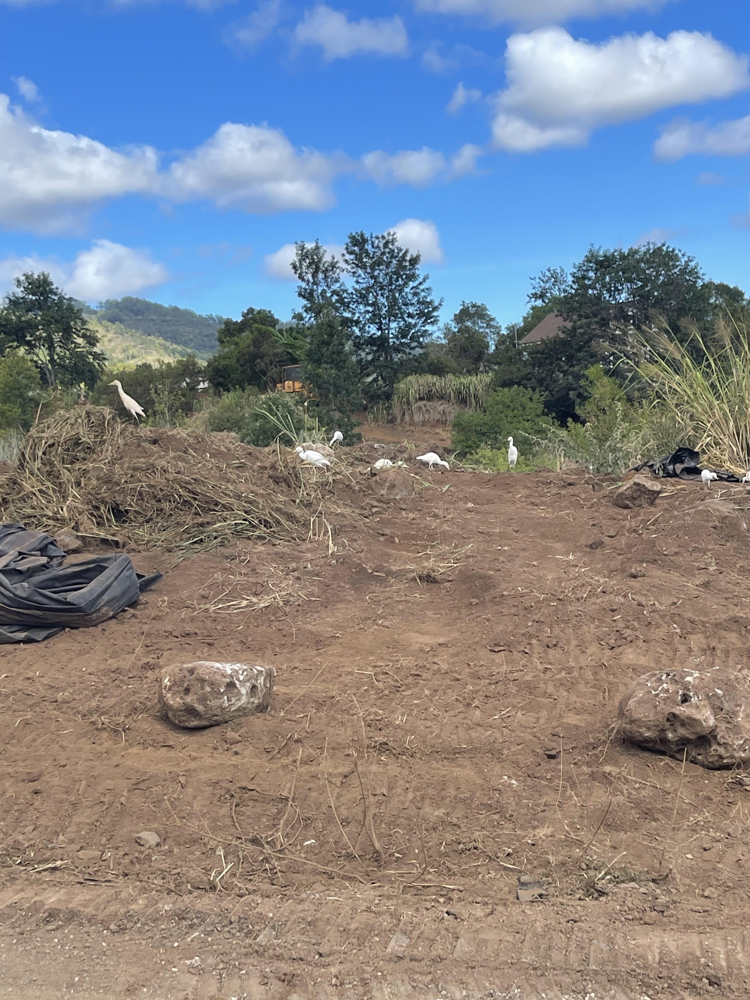

### Rock and weed removal from our land in Kunia
This was around the same time as when I visited and replanted/cleaned the lo'i in June, 2021. This was our acre of land located in Kunia that we had to help remove invasive weeds, specifically the colloquially termed California grass which is an extremely fast spreading species, along with rocks and just overall clearing out the land for dirt compaction. We used a mix of hand weeding and construction equipment to remove the weeds and rocks.
Definitely a fun experience, although it does require constant maintenance due to how quickly those weeds can overtake that barren dirt again.

