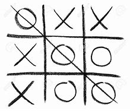

Just a little tictactoe game that was given as an assignment in my ICS 211 class. It was written in Java using JGRASP, which also happened to be pretty much my first IDE I had used, and just has the basic features of a tictactoe game. While it may seem like a mess and the code is completely inconsistent and inefficient, it was still one of my first actual coding projects (and one of the few I could find on my old laptop):

<pre>

</pre>

