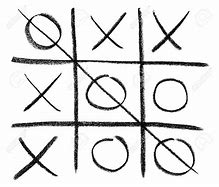

Just a little tictactoe game that was given as an assignment in my ICS 211 class. It was written in Java using JGRASP, which also happened to be pretty much my first IDE I had used, and just has the basic features of a tictactoe game. Below is some of the code, but please excuse the messiness and comments:

```cp
// author: puiwa perry
// purpose: tic tac toe game
// date: 10/10/2022

import javax.swing.*;
import java.awt.*;
import java.awt.Color;
import java.util.*;
import java.awt.event.*;
import java.io.*;

public class TicTacToe extends JFrame{

// instance array of JButtons and other variables, i was having a ton of like out of bounds or 
// cannot find symbol issues with this because i was declaring it in the createGUI method,
// but then i remembered that i should state it up here so its not local i think
   final int height = 400;
   final int width = 400;
   Color PURPLE = new Color(125, 0, 135); 
   Color BLACKISH = new Color(35, 35, 35);
   JButton[] buttonArray = new JButton[9];
   
   public TicTacToe(){
      this.setSize(height,width);
      this.setBackground(Color.BLACK);
      this.setForeground(Color.BLACK);
      this.setTitle("TicTacToe");
      this.setDefaultCloseOperation(JFrame.EXIT_ON_CLOSE);
      this.setVisible(true);
   
   }
 // this sets up the panel, adds it to the frame, and adds buttons to the panel
   public void createGUI(){
   
   //some of the variable stuff
      ActionListener al = new MyListener();
      JPanel container = new JPanel();
      container.setLayout(new GridLayout(3, 3));
      container.setBackground(Color.BLACK);
      container.setForeground(Color.BLACK);
      
   // a for loop using the JButton array that just creates the buttons,
   // adds them to the array, and adds the listener into them   
      for(int i = 0; i < buttonArray.length; i++){
         JButton button = new JButton("");
         button.setBackground(Color.BLACK);
    // over here i didnt know how to change border color so i had to see
    // some of the java stuff online
         button.setBorder(BorderFactory.createLineBorder(BLACKISH));
    // i was also trying to figure out how to disable the button turning gray
    // when clicking so i found this
         button.setContentAreaFilled(false);
    // it was also highlighting the button text when clicking so i needed
    // a fix for that too
         button.setFocusPainted(false);
         buttonArray[i] = button;
         buttonArray[i].addActionListener(al);
         container.add(buttonArray[i]);     
      
      }
      
      //adds panel to frame
      this.add(container);
   
   }
   
       

   
 // the mylistener inner class and action method
   private class MyListener implements ActionListener{
   
   // runs if player wins
         public void playerWins(){
            this.endSetup("Player");
            System.out.println("Player wins");
            for(int i = 0; i < buttonArray.length; i++){
            
            // these loops disable the buttons if there is a winner
               if(buttonArray[i].getText().equals("")){
                  buttonArray[i].setEnabled(false);
               }
            }                      
         }
      //runs if computer wins   
         public void computerWins(){
            this.endSetup("Computer");
            System.out.println("Computer wins");
            for(int i = 0; i < buttonArray.length; i++){
               if(buttonArray[i].getText().equals("")){
                  buttonArray[i].setEnabled(false);
               }
            }              
         }
     // runs if tie    
         public void isTie(){
            System.out.println("Tie");
            for(int i = 0; i < buttonArray.length; i++){
               if(buttonArray[i].getText().equals("")){
                  buttonArray[i].setEnabled(false);
               }
            }               
         }
         
      public void endSetup(String winner){
         TicTacToe endScreen = new TicTacToe();
         JPanel endPane = new JPanel();
         endPane.setBackground(BLACKISH);
         JLabel endMessage = new JLabel("");
         endMessage.setForeground(Color.GRAY);
         if(winner.equals("Tie")){
            endMessage.setText(winner + ", data stored in Tfile.txt");
         } else {
            endMessage.setText(winner + " wins, data stored in Tfile.txt");
           }
           
         endPane.add(endMessage);
         endPane.setVisible(true);
         endScreen.add(endPane);
         endScreen.setVisible(true);
         //this.fileCreate(String winner);
      }
      
      
// i got super stuck on this file creation part because of exception stuff  ///////////////

/*   
      public void fileCreate(String winner) throws Exception{
      
      try{
         File score = new File("Tfile.txt");
         FileWriter fw = new FileWriter(score);
         PrintWriter pw = new PrintWriter(fw);
         pw.println(winner + " won this game");
         pw.close();
         
      } catch(FileNotFoundException fe){
         System.out.println("uh");
        }
      }
      
      */
      
      
      
   // i think i had a better way of doing a victory check by splitting up the big 9 length array into
   // 3 smaller arrays and using a for loop to check stuff, but i got far into typing this so i
   // didnt want to go back and do it, although theres probably a better way to do this even with the bigger array
      public boolean victoryCheck(){
         //boolean end = false;
         
     //check if tie
         //this checks vertical
           for(int i = 0; i < 3; i++){
              if(buttonArray[i].getText().equals(buttonArray[i+3].getText()) && buttonArray[i+3].getText().equals(buttonArray[i+6].getText())){
                
                 if(buttonArray[i].getText().equals("X")){
                    this.playerWins();
                    return true;
                    
                    
                 } else if(buttonArray[i].getText().equals("O")){
                       this.computerWins();
                       return true;
                   }
              
              }
           }
          
          // this checks horizontal 
           for(int i = 0; i < buttonArray.length; i=i+3){
              if(buttonArray[i].getText().equals(buttonArray[i+1].getText()) && buttonArray[i+1].getText().equals(buttonArray[i+2].getText()))
                 if(buttonArray[i].getText().equals("X")){
                    this.playerWins();
                    return true;                   
                 } else if(buttonArray[i].getText().equals("O")){
                       this.computerWins();
                       return true;
                   }
              }
           
           // super long one line code for diagonal check idk why i did this
           // probably neater to make it two if statements instead   
              if((buttonArray[0].getText().equals(buttonArray[4].getText()) && buttonArray[4].getText().equals(buttonArray[8].getText())) || (buttonArray[2].getText().equals(buttonArray[4].getText()) && buttonArray[4].getText().equals(buttonArray[6].getText()))){
                    if(buttonArray[4].getText().equals("X")){
                       this.playerWins();
                       return true;
                    
                 } else if(buttonArray[4].getText().equals("O")){
                       this.computerWins();
                       return true;
                   }
              
                  int tieCheckCount = 0;
                  for(int i = 0; i < buttonArray.length; i++){
                     if(!buttonArray[i].getText().equals("")){
                     tieCheckCount++; 
                  }
                      }
           
                  if(tieCheckCount == buttonArray.length){
                     this.isTie();
                     return true;      
                  }

              }
              
              return false;
           }
             
     
   //sstart of action event listener method
   
          public void actionPerformed(ActionEvent event){
          
         // when i was making this i was originally going to add an
         // if statement for each individual element in the button array
         // on click, but then i thought what if i for loop this instead??? 
            for(int i = 0; i < buttonArray.length; i++){           
               if(event.getSource() == buttonArray[i] && buttonArray[i].getText().equals("")){                 
                  buttonArray[i].setForeground(PURPLE);
                  buttonArray[i].setText("X");
                  
              // i was having issues with an infinite loop if the last spot was taken
              // and it was a tie, so i only made the computer play if there is no winner yet    
                  if(this.victoryCheck() == false){                 
                     int randomBox = 0;
                     Random rand = new Random();
                     randomBox = rand.nextInt(9);
                  
                     while(!buttonArray[randomBox].getText().equals("")){
                        this.victoryCheck();
                        randomBox = rand.nextInt(9);
                     }                      
          
                     if(buttonArray[randomBox].getText().equals("")){
                        buttonArray[randomBox].setForeground(Color.WHITE);
                        buttonArray[randomBox].setText("O");
                        this.victoryCheck();
                     }                  
                  }         
               }
            }        
      } 
   }  
}       


```
<hr>

<pre>

</pre>

<hr>
